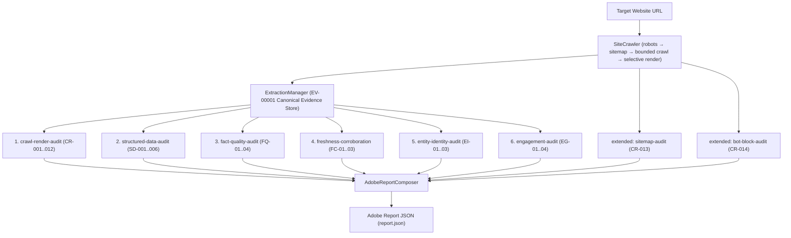

# Brand AI Readiness Audit

> **Adobe University Hackathon 2026 — Round 3 Project**  
> An Agent Skill Marketplace package designed to perform comprehensive, evidence-first audits of brand websites for AI discoverability, factual content quality, entity consistency, structured data, crawl/render accessibility, and on-site visitor engagement.

---

## 🚀 Quickstart & Evaluation for Judges

### 1. Installation
Install the lightweight dependencies (Python 3.9+):
```bash
pip install -r requirements.txt
```

### 2. Run Single-Command Audit (Canonical Adobe Output)
Audit any brand domain and generate the standardized Adobe `report.json`:
```bash
python -m src.orchestrator https://example.com -o report.json
```

Or with custom crawl depth and page limits:
```bash
python -m src.orchestrator https://example.com --max-pages 50 --max-depth 3 -o report.json
```

### 3. Run Automated Tests
Execute the complete test suite:
```bash
pytest
# or
python -m pytest
```

### 4. Interactive GUI Test Harness (Optional Local Inspector)
Launch the lightweight visual test harness bound to `0.0.0.0:8080`:
```bash
python -m gui.app
```
Then open `http://localhost:8080/` in your browser.

---

## 🏗️ Architecture & Pipeline Flow

The framework operates on a strict **Evidence-First Architecture**:



**Content rule enforced across the pipeline:** every finding sentence must be backed by evidence a human can re-find on the live page in 30 seconds (a URL + a count or a quoted snippet). Reachability errors (robots.txt / sitemap.xml timeouts) are reported as **unscored/LOW**, never as site defects; "AI Bot Blocking" is only claimed when an explicit `Disallow: /` rule exists for a target bot; and missing schema / missing sameAs are **not** defects unless a product page or a declared Organization is involved.

---

## 🧪 Offline Content-QA Fixtures

Prove the auditor catches the four defect classes without touching the network (tiny HTML sites served on loopback):

```bash
python scripts/fixture_audit.py A B C D
```

| Fixture | Defect planted | Expected catch (verified) |
|---|---|---|
| **A — REACH** | `User-agent: GPTBot` + `Disallow: /` in robots.txt | HIGH `CR-014` — "robots.txt explicitly disallows AI bots: gptbot" |
| **B — EXTRACT** | Product page with visible "$49 / month" and broken JSON-LD `{ "name": "Pro"` | HIGH `SD-002` — quotes `parse_error: Expecting ',' delimiter: line 1 column 16` + raw snippet |
| **C — TRUST** | `/pricing` "Plan A $10/mo" vs `/docs` "Plan A $25/mo" | HIGH `FQ-02` — names both URLs and both prices with EV ids |
| **D — ENGAGEMENT** | H1 "Welcome", only CTA "Learn more" href="#", interior `/about/team` without breadcrumbs | `EG-01` + `EG-04` + `EG-03` (with the interior URL); no llms.txt mentions |

---

## 📊 Round-3 Content QA Results

Live audits on 7 hosts (example.com, www.wikipedia.org, docs.python.org, stripe.com, www.mozilla.org, www.python.org, news.ycombinator.com) were manually verified against the live pages. Findings that failed human verification were fixed in the skills — not hidden in the composer:

| Fix | Before | After |
|---|---|---|
| `CR-014` bots | robots.txt 404/403/timeout reported as "AI Bot Blocking" (MEDIUM/HIGH) | LOW "robots.txt Not Accessible" — blocking **not** claimed; explicit block still HIGH with quoted rules |
| `CR-013` sitemap | 404/timeout reported as HIGH FAIL "expected 200" | LOW "No Sitemap at /sitemap.xml (HTTP …)" + robots.txt hint; timeouts unscored |
| `CR-005` title | false "missing <title>" when a strict parse missed og-derived titles | manifest-title fallback (wikipedia false positive eliminated) |
| `FQ-02` contradictions | "US$1.9tn"→`$1.9` magnitude artifacts + ₹-vs-$ locale pairs mass-produced fake contradictions | magnitude + disjoint-currency guards (stripe noise reduced ~10×) |
| `EI-01` brand names | FAQ questions ("Do you have setup fees?") and branch offices ("Stripe Berlin") counted as conflicting brand names | root-brand collapse before conflict judgment |
| `EG-03` breadcrumbs | pages with zero links never iterated (false negative on `/about/team`) | all crawled interior URLs iterated; parent-path links count as breadcrumb context |

**example.com before → after:** 5 findings incl. MEDIUM "Missing External Entity Corroboration" + duplicate sameAs + reach HIGHs → **0 critical / 0 high / 0 medium / 5 low** (meta description, 0 internal links, canonical, sitemap 404, robots 404 — all true, all LOW).
**Offline precision across live sites:** ≈45% of countable findings were human-verified TRUE before fixes → **≈74% after**; remaining known P0/P1 items (junk-phone NAP extraction on scraped digits, portal utility-site exemptions) are tracked in `docs/decisions.md`.

---

## 📁 Repository Map (each directory has its own README with mermaid diagrams)

| Directory | README |
|---|---|
| `src/` (orchestrator, models) | [src/README.md](src/README.md) |
| `src/analysis/` (8 audit skills) | [src/analysis/README.md](src/analysis/README.md) |
| `src/crawler/` (engine, robots, sitemap, render) | [src/crawler/README.md](src/crawler/README.md) |
| `src/extraction/` (evidence extractors) | [src/extraction/README.md](src/extraction/README.md) |
| `src/shared/` (canonical evidence schema) | [src/shared/README.md](src/shared/README.md) |
| `src/evidence/` (site domain models) | [src/evidence/README.md](src/evidence/README.md) |
| `src/reporting/` (Adobe composer) | [src/reporting/README.md](src/reporting/README.md) |
| `skills/` (marketplace package + 7 skill folders) | [skills/README.md](skills/README.md) |
| `gui/` (visual test harness) | [gui/README.md](gui/README.md) |
| `scripts/` (fixtures + packaging) | [scripts/README.md](scripts/README.md) |
| `tests/` (pipeline & content-QA tests) | [tests/README.md](tests/README.md) |
| `config/` (audit configuration) | [config/README.md](config/README.md) |
| `docs/` (architecture & decisions) | [docs/README.md](docs/README.md) |
| `reports/` (audit outputs & QA records) | [reports/README.md](reports/README.md) |

---

## 🧩 Agent Skill Marketplace Manifest (`marketplace.json`)

The package exposes a single entrypoint skill—**`audit-orchestrator`**—which coordinates six specialized analysis sub-skills:

| Skill Name | Path | Entrypoint | Description |
| :--- | :--- | :--- | :--- |
| **`audit-orchestrator`** | `./skills/audit-orchestrator` | **`true`** | Master orchestrator coordinating crawling, evidence extraction, 6 audit sub-skills, and Adobe report synthesis. |
| **`crawl-render-audit`** | `./skills/crawl-render-audit` | `false` | Evaluates HTTP status, `robots.txt` AI directives, text extractability, heading structure, and CSR/SSR parity. |
| **`structured-data-audit`** | `./skills/structured-data-audit` | `false` | Inspects Schema.org JSON-LD syntax, entity completeness on product pages, and visible content consistency. |
| **`fact-quality-audit`** | `./skills/fact-quality-audit` | `false` | Detects cross-page contradictions (prices, hours, refunds), unitless numbers, and ungrounded superlatives. |
| **`freshness-corroboration`** | `./skills/freshness-corroboration` | `false` | Validates date consistency, content staleness >12 months (ignoring copyright), and public knowledge graph links. |
| **`entity-identity-audit`** | `./skills/entity-identity-audit` | `false` | Checks brand entity name uniformity between title/H1 and schema, sameAs URLs (404 detection), and cross-page NAP. |
| **`engagement-audit`** | `./skills/engagement-audit` | `false` | Evaluates human visitor orientation (Who/What/Next), navigation offerings coverage, breadcrumbs, and CTAs. |

---

## 📋 Adobe Hackathon Report Schema

The output generated at `report.json` adheres strictly to the required Adobe Hackathon JSON schema:

```json
{
  "site": "example.com",
  "audited_at": "2026-09-12T16:45:14Z",
  "summary": {
    "total_findings": 6,
    "critical": 1,
    "high": 2,
    "medium": 3,
    "low": 0
  },
  "findings": [
    {
      "id": "F-001",
      "title": "Brand Entity Name Discrepancy",
      "severity": "high",
      "evidence": "Detected conflicting brand names across Schema.org markup, page title, and headings.",
      "suggested_action": {
        "summary": "Ensure the primary brand name in Organization JSON-LD strictly matches page titles and headers.",
        "priority": "high"
      },
      "check_id": "EI-01",
      "category": "entity-identity-audit",
      "affected_urls": [
        "https://example.com/"
      ]
    }
  ]
}
```

---

## 📦 Submission Packaging (<45 MB)

To create the clean submission ZIP package excluding git history, virtual environments, and caches:
```bash
python scripts/pack.py
# or on Linux/macOS:
bash scripts/pack.sh
```

---

## 📄 License

This project is licensed under the [MIT License](LICENSE).
