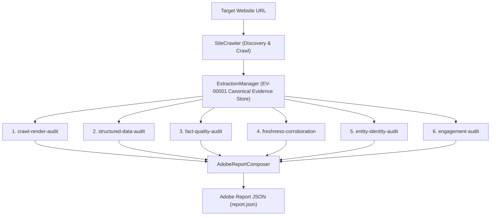

# Brand AI Readiness Audit

> **Adobe University Hackathon 2026 — Round 3 Project**  
> An Agent Skill Marketplace package designed to perform comprehensive, evidence-first audits of brand websites for AI discoverability, factual content quality, entity consistency, structured data, crawl/render accessibility, and on-site visitor engagement.

---

## 🚀 Quickstart & Evaluation for Judges

### 1. Installation
Install the lightweight dependencies (Python 3.9+):
```bash
pip install -r requirements.txt
```

### 2. Run Single-Command Audit (Canonical Adobe Output)
Audit any brand domain and generate the standardized Adobe `report.json`:
```bash
python -m src.orchestrator https://example.com -o report.json
```

Or with custom crawl depth and page limits:
```bash
python -m src.orchestrator https://example.com --max-pages 50 --max-depth 3 -o report.json
```

### 3. Run Automated Tests
Execute the complete test suite:
```bash
pytest
# or
python -m pytest
```

### 4. Interactive GUI Test Harness (Optional Local Inspector)
Launch the lightweight visual test harness bound to `0.0.0.0:8080`:
```bash
python -m gui.app
```
Then open `http://localhost:8080/` in your browser.

---

## 🏗️ Architecture & Pipeline Flow

The framework operates on a strict **Evidence-First Architecture**:



---

## 🧩 Agent Skill Marketplace Manifest (`marketplace.json`)

The package exposes a single entrypoint skill—**`audit-orchestrator`**—which coordinates six specialized analysis sub-skills:

| Skill Name | Path | Entrypoint | Description |
| :--- | :--- | :--- | :--- |
| **`audit-orchestrator`** | `./skills/audit-orchestrator` | **`true`** | Master orchestrator coordinating crawling, evidence extraction, 6 audit sub-skills, and Adobe report synthesis. |
| **`crawl-render-audit`** | `./skills/crawl-render-audit` | `false` | Evaluates HTTP status, `robots.txt` AI directives, text extractability, heading structure, and CSR/SSR parity. |
| **`structured-data-audit`** | `./skills/structured-data-audit` | `false` | Inspects Schema.org JSON-LD syntax, entity completeness on product pages, and visible content consistency. |
| **`fact-quality-audit`** | `./skills/fact-quality-audit` | `false` | Detects cross-page contradictions (prices, hours, refunds), unitless numbers, and ungrounded superlatives. |
| **`freshness-corroboration`** | `./skills/freshness-corroboration` | `false` | Validates date consistency, content staleness >12 months (ignoring copyright), and public knowledge graph links. |
| **`entity-identity-audit`** | `./skills/entity-identity-audit` | `false` | Checks brand entity name uniformity between title/H1 and schema, sameAs URLs (404 detection), and cross-page NAP. |
| **`engagement-audit`** | `./skills/engagement-audit` | `false` | Evaluates human visitor orientation (Who/What/Next), navigation offerings coverage, breadcrumbs, and CTAs. |

---

## 📋 Adobe Hackathon Report Schema

The output generated at `report.json` adheres strictly to the required Adobe Hackathon JSON schema:

```json
{
  "site": "example.com",
  "audited_at": "2026-09-12T16:45:14Z",
  "summary": {
    "total_findings": 6,
    "critical": 1,
    "high": 2,
    "medium": 3,
    "low": 0
  },
  "findings": [
    {
      "id": "F-001",
      "title": "Brand Entity Name Discrepancy",
      "severity": "high",
      "evidence": "Detected conflicting brand names across Schema.org markup, page title, and headings.",
      "suggested_action": {
        "summary": "Ensure the primary brand name in Organization JSON-LD strictly matches page titles and headers.",
        "priority": "high"
      },
      "check_id": "EI-01",
      "category": "entity-identity-audit",
      "affected_urls": [
        "https://example.com/"
      ]
    }
  ]
}
```

---

## 📦 Submission Packaging (<45 MB)

To create the clean submission ZIP package excluding git history, virtual environments, and caches:
```bash
python scripts/pack.py
# or on Linux/macOS:
bash scripts/pack.sh
```

---

## 📄 License

This project is licensed under the [MIT License](LICENSE).
