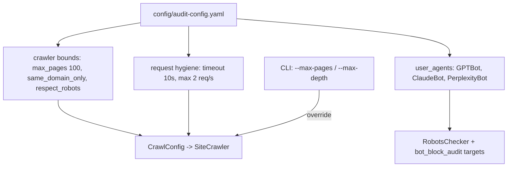

# `config/` — Audit Configuration

**Business logic:** the honest-audit knobs: how many pages to crawl, how politely, and as *whom*. `user_agents` lists the AI bots the reach checks probe for (GPTBot, ClaudeBot, PerplexityBot) — the reach analysis is only meaningful if it is checked against the robots rules those exact crawlers would see.

**Tech logic:** single YAML file consumed via `CrawlConfig` defaults and CLI overrides: crawl bounds (`max_pages: 100`, `same_domain_only: true`, `respect_robots: true`), request hygiene (`request_timeout_seconds: 10`, `max_requests_per_second: 2`), and the target UA list. The CLI flags `--max-pages` / `--max-depth` override bounds per run.

### `audit-config.yaml`
**Business:** the declared audit policy — polite crawling, in-scope only, robots respected — that a brand team reads before allowing the crawl.
**Tech:** two sections (crawl + user agents); values map 1:1 onto `CrawlConfig` fields in `src/crawler/engine.py`.

**Parent:** [repository root README](../README.md).