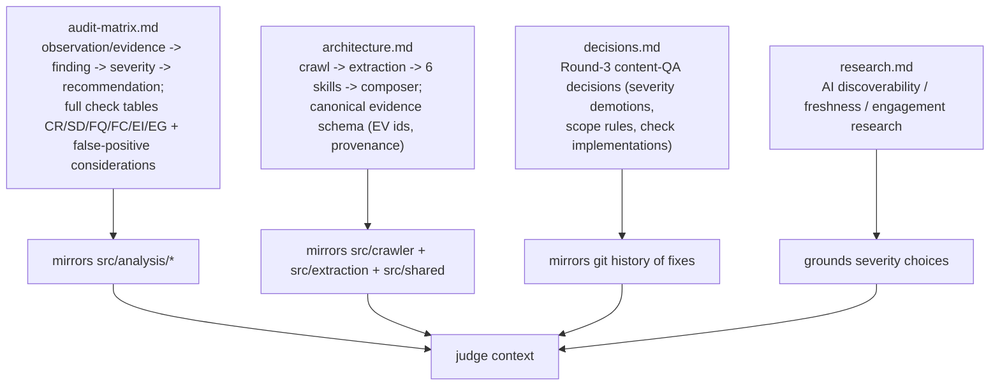

# `docs/` — Design Documentation

**Business logic:** the written reasoning a judge reads to understand *why* the audit measures what it measures: the observation→finding→severity→recommendation evidence model, the full audit matrix (every check id with severity and false-positive notes), architecture decisions, and Round-3 research.

**Tech logic:** four markdown documents mirroring the implementation:

| File | Reads best for |
|---|---|
| `audit-matrix.md` | every check id, severity, and false-positive consideration (e.g. EG skill scope note excluding llms.txt/OpenAPI/chatbot) |
| `architecture.md` | pipeline flow, evidence schema, component responsibilities |
| `decisions.md` | the content-QA verdicts and their fixes from Round 3 |
| `research.md` | background research on AI discoverability, freshness, engagement |

**Parent:** [repository root README](../README.md).