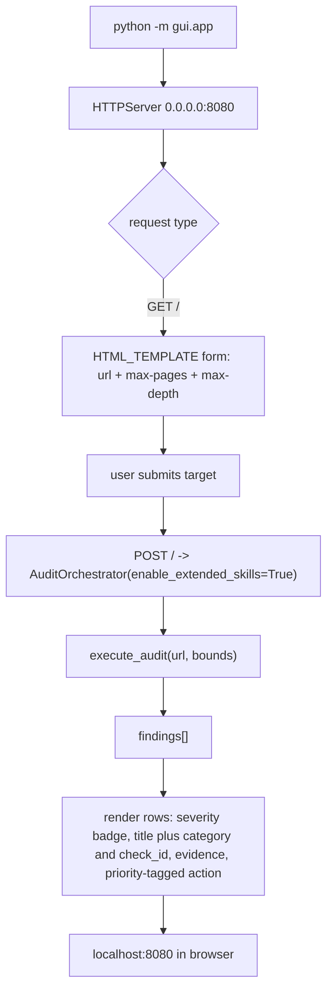
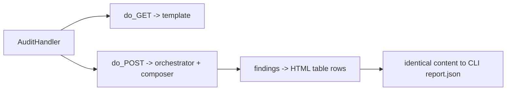

# `gui/` — Interactive Test Harness

**Business logic:** a judge-friendly visual inspector. Running `python -m gui.app` serves a single page where anyone can launch an audit and see findings rendered as severity badges, titles, evidence, and suggested actions — no JSON squinting. It exists to *show* the report, never to change it.

**Tech logic:** `app.py` binds a lightweight `HTTPServer` to `0.0.0.0:8080`, handles GET (serve HTML_TEMPLATE) and POST (run `AuditOrchestrator(enable_extended_skills=True)` with the submitted URL and bounds, then compose `AdobeReportComposer` output into HTML rows). Findings render with severity badge classes, `check_id` + category under the title, evidence text, and `[PRIORITY]`-tagged actions.

### `app.py`
**Business:** the demo surface — a person with no terminal can audit example.com and read the findings.
**Tech:** single-file server; orchestrator + composer reused directly (the GUI adds zero audit logic, so the harness always shows exactly what the CLI would produce).

**Parent:** [repository root README](../README.md).