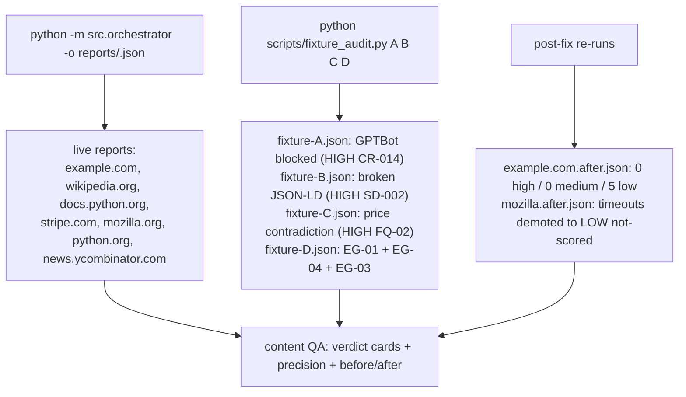

# `reports/` — Audit Outputs & Content-QA Records

**Business logic:** this folder holds the evidence trail of the Round-3 content review: real-site `report.json` outputs (before/after fixes), the fixture reports proving every defect class is caught, and the run logs. It is intentionally committed so evaluators can diff the before/after finding lists (e.g. example.com dropping from HIGH/medium false defects to 5 LOW truths).

**Tech logic:** files named `<host>.json` (live audits), `example.com.after.json` / `mozilla.after.json` (post-fix re-runs), `fixture-{A,B,C,D}.json` (offline content-QA runs from `scripts/fixture_audit.py`), and `.log` files from the orchestrator CLI runs.

**Parent:** [repository root README](../README.md).