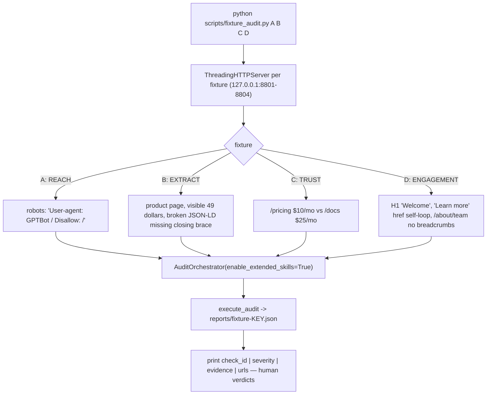
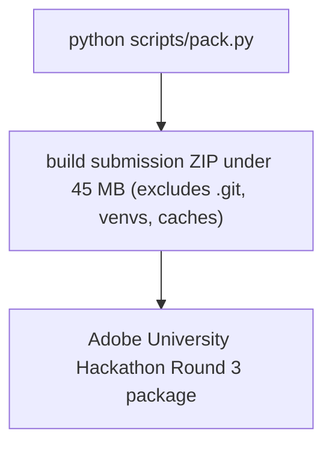

# `scripts/` — QA Fixtures & Submission Packaging

**Business logic:** two jobs that protect content quality: (1) `fixture_audit.py` — the offline content-QA harness that proves the auditor catches the four known defect classes (reach, extract, trust, engagement) with quoted evidence, using tiny local HTML servers so tests never depend on network luck; (2) `pack.py` — builds the <45 MB submission ZIP judges download.

**Tech logic:** `fixture_audit.py` serves 4 fixture site maps over `ThreadingHTTPServer` on loopback (robots.txt + homepage + interior pages), constructs `AuditOrchestrator(enable_extended_skills=True)`, runs `execute_audit`, saves `reports/fixture-<key>.json`, and prints each finding's check_id/severity/evidence/urls for human review.

### `fixture_audit.py`
**Business:** the content-QA regression harness — proves the four defect classes are caught with quoted evidence, offline and deterministically.
**Tech:** one `type()`-generated handler per fixture serves the site map (robots.txt + pages); orchestrator runs with extended skills so `CR-013`/`CR-014` are exercised; composed `report.json` per fixture is printed for human verdicts.

### `pack.py`
**Business:** the submission artifact — judges unzip one package and run `pip install -r requirements.txt && python -m src.orchestrator …`.
**Tech:** cross-platform (Python and a `pack.sh` shell twin) ZIP builder that excludes `.git`, `.venv`, `__pycache__`, `.pytest_cache`, and scratch report logs.

**Parent:** [repository root README](../README.md).