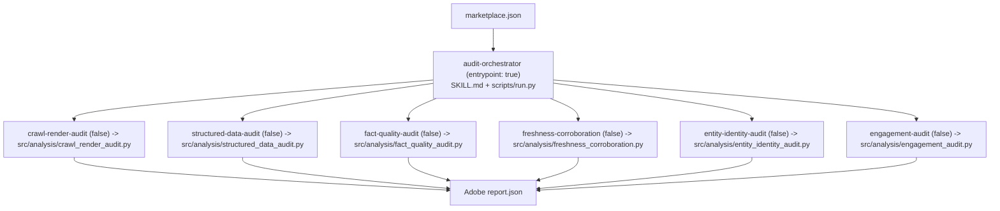

# `skills/` — Agent Skill Marketplace Package

**Business logic:** this folder is the *packaging* of the audit as an Agent Skill Marketplace submission. Each subfolder is one marketplace skill with a `SKILL.md` manifest (name, description, purpose, operational constraints, code entrypoint) — the auditable description of what the skill does, plus `references/` for supporting docs and `scripts/` for entrypoints. The manifest is what makes the audit a *skill* rather than a script: an agent can read `SKILL.md` and know exactly what it may run and what it produces.

**Tech logic:** there is exactly **one** entrypoint skill — `audit-orchestrator` (`scripts/run.py`, flagged `true` in `marketplace.json`). The six analysis skills are sub-skills (flagged `false`); each declares its code module under `src/analysis/` so the marketplace layer stays a thin manifest over the real Python implementation.

| Skill folder | Entrypoint code | Business question |
|---|---|---|
| `audit-orchestrator/` | `src/orchestrator.py` | run everything, produce report.json |
| `crawl-render-audit/` | `src/analysis/crawl_render_audit.py` | can AI crawlers read the site? |
| `structured-data-audit/` | `src/analysis/structured_data_audit.py` | can AI extract facts/prices? |
| `fact-quality-audit/` | `src/analysis/fact_quality_audit.py` | is the content self-consistent? |
| `freshness-corroboration/` | `src/analysis/freshness_corroboration.py` | is content current and corroborated? |
| `entity-identity-audit/` | `src/analysis/entity_identity_audit.py` | is the brand entity unambiguous? |
| `engagement-audit/` | `src/analysis/engagement_audit.py` | does the page orient and convert? |

Each subfolder has its own `README.md` with a mermaid diagram of its manifest → code → findings flow.

**Parent:** [repository root README](../README.md).