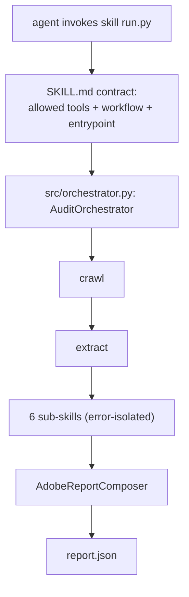
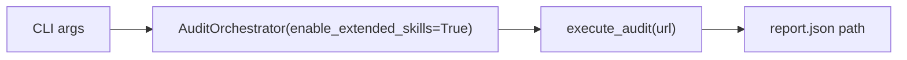

# Skill: `audit-orchestrator` (marketplace entrypoint: **true**)

**Business:** the one skill a judge installs. Given a URL it returns the canonical Adobe `report.json` — nothing else to configure, nothing else to trust.
**Tech:** `SKILL.md` declares purpose, allowed tools (GET/parse/read-write of reports only, no destructive network writes), execution workflow (validate → crawl → extract → 6 sub-skills → error isolation → compose), and the code entrypoint `src/orchestrator.py`. `scripts/run.py` is the marketplace-invoked launcher.

### `SKILL.md`
**Business:** the readable guarantee of what the skill will and won't do — the document an agent reads before executing.
**Tech:** frontmatter `name` + `description`; body: purpose, operational constraints, numbered execution workflow, code entrypoint pointer.

### `scripts/run.py`
**Business:** marketplace-compliant launcher — one command, same behavior as `python -m src.orchestrator`.
**Tech:** thin wrapper: parses CLI args (url, `--max-pages`, `--max-depth`, `-o`), constructs `AuditOrchestrator(enable_extended_skills=True)`, executes, prints the output path.

**Parent:** [skills README](../README.md).