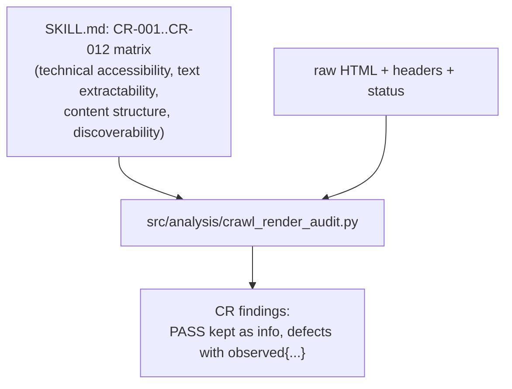
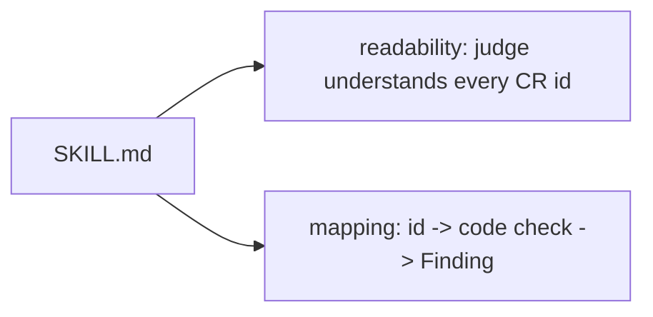

# Skill: `crawl-render-audit` (sub-skill)

**Business:** answers "can an AI crawler physically read this site?" — status codes, robots directives, titles, headings, extractable text, canonical, internal links. Its evidence is what judges re-check first.
**Tech:** `SKILL.md` documents the check matrix CR-001…CR-012 with severity and false-positive considerations; code entrypoint `src/analysis/crawl_render_audit.py`; `references/` and `scripts/` reserved (placeholders).

### `SKILL.md`
**Business:** the check matrix a reviewer reads — what each CR id means, its severity range, and its false-positive considerations (e.g. empty container divs signal CSR dependence).
**Tech:** frontmatter `name`/`description`; tables of check ids, titles, category, severity, and scoring notes; entrypoint pointer to `src/analysis/crawl_render_audit.py`.

**Parent:** [skills README](../README.md).