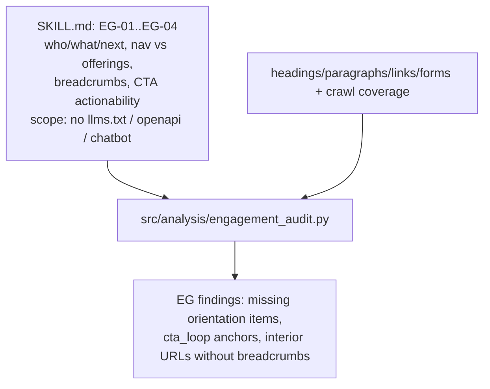
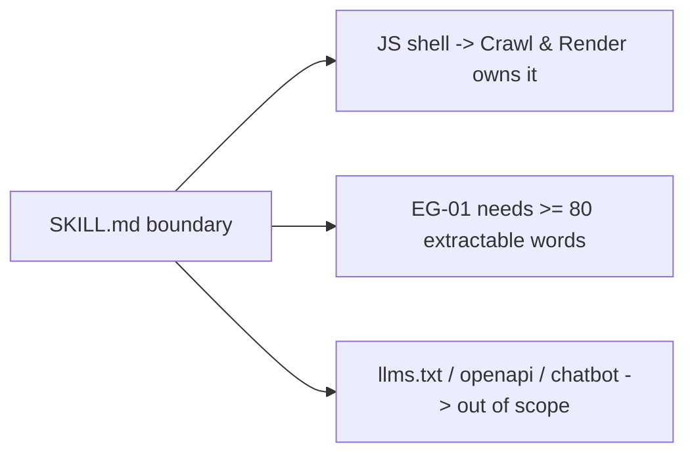

# Skill: `engagement-audit` (sub-skill)

**Business:** answers "does this page orient a human visitor and convert them?" — who/what/next above the fold, navigation that covers offerings, breadcrumbs on deep pages, and CTAs that actually act. The manifest states the scope: *human visitor orientation only* — missing `/llms.txt`, `/openapi.json`, or chat widgets are deliberately out of scope.
**Tech:** `SKILL.md` documents EG-01…EG-04 with the false-positive guard: JS shells (<80 words) are owned by the crawl skill, so EG-01 must not double-count; code entrypoint `src/analysis/engagement_audit.py`.

### `SKILL.md`
**Business:** draws the ownership boundary between skills (EG-01 doesn't flag <80-word shells — CR-003 already does) and between on-site and out-of-scope topics.
**Tech:** severity table + scope note + entrypoint pointer.

**Parent:** [skills README](../README.md).