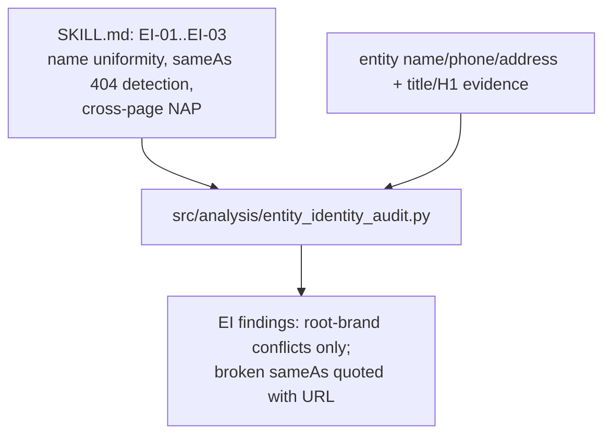
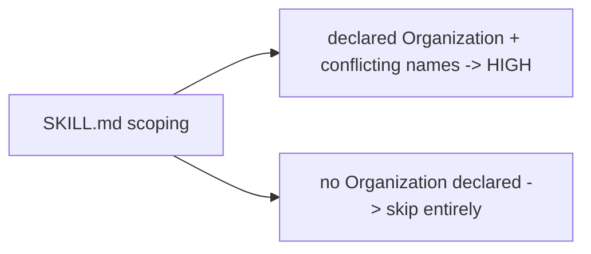

# Skill: `entity-identity-audit` (sub-skill)

**Business:** answers "can an AI form one confident entity for this brand?" Brand-name discrepancies between schema/title/H1, broken sameAs profiles, and cross-page NAP conflicts fragment identity in generative answers.
**Tech:** `SKILL.md` documents EI-01…EI-03 (name uniformity, sameAs verification with 404 detection, cross-page NAP) — with the Round-3 rule that FAQ-question strings and branch-office names are not conflicting brand names; code entrypoint `src/analysis/entity_identity_audit.py`.

### `SKILL.md`
**Business:** scopes identity defects to *declared* entities: no Organization schema means no identity failure to report — silence is the correct output.
**Tech:** severity table + false-positive notes + entrypoint pointer.

**Parent:** [skills README](../README.md).