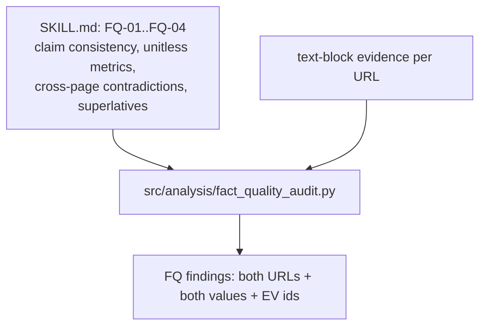
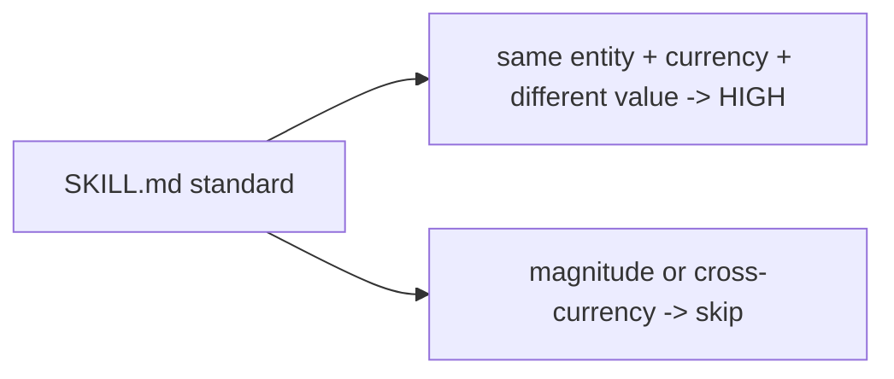

# Skill: `fact-quality-audit` (sub-skill)

**Business:** answers "will an AI contradict itself if it quotes this brand?" Cross-page price contradictions, unitless numbers, and ungrounded superlatives degrade factual credibility in generative answers.
**Tech:** `SKILL.md` documents FQ-01…FQ-04 (claim consistency, unitless metrics, contradictions, superlatives) — including the Round-3 refinements: monetary magnitudes (`$1.9tn`) and disjoint-currency pairs (₹ vs $) are not contradictions; code entrypoint `src/analysis/fact_quality_audit.py`.

### `SKILL.md`
**Business:** defines what counts as a contradiction (same claim type, same entity, same currency, genuinely different values) — the written standard that keeps locale pricing from being misreported.
**Tech:** severity table; example evidence shape; entrypoint pointer.

**Parent:** [skills README](../README.md).