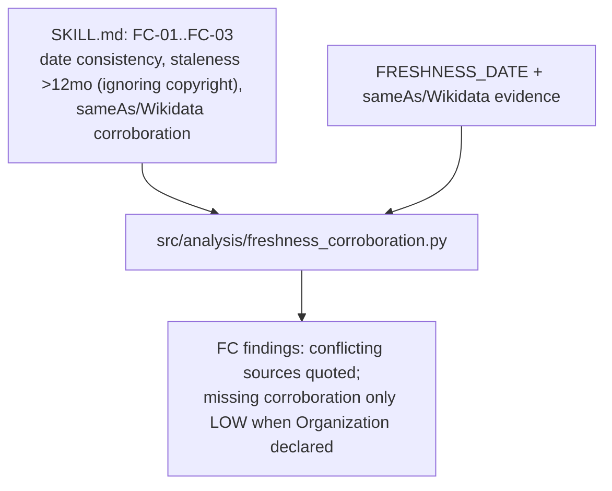
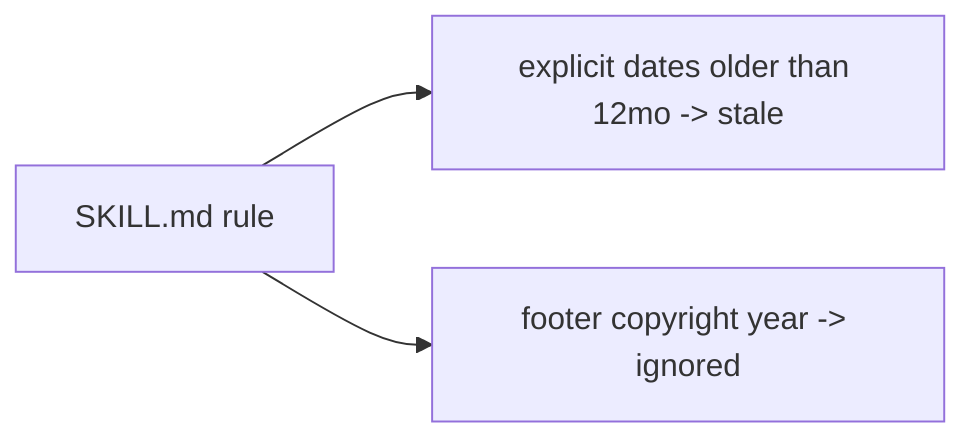

# Skill: `freshness-corroboration` (sub-skill)

**Business:** answers "is this content current, and can its identity claims be corroborated by public sources?" Date conflicts, stale content, and broken Knowledge-Graph links degrade recency ranking and citation confidence. The manifest states in writing that footer copyright years are ignored as staleness signals.
**Tech:** `SKILL.md` documents FC-01…FC-03 (date consistency, staleness, sameAs/Wikidata corroboration) — including the Round-3 rule that missing sameAs on a non-brand/placeholder domain is not a trust failure; code entrypoint `src/analysis/freshness_corroboration.py`.

### `SKILL.md`
**Business:** encodes the copyright-vs-content distinction: staleness is judged from dateModified/datePublished/Last-Modified/`<time>` only — never from `© 2024` in a footer.
**Tech:** check table + scoring notes + entrypoint pointer.

**Parent:** [skills README](../README.md).