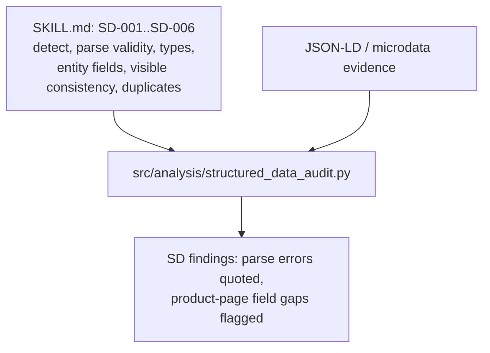
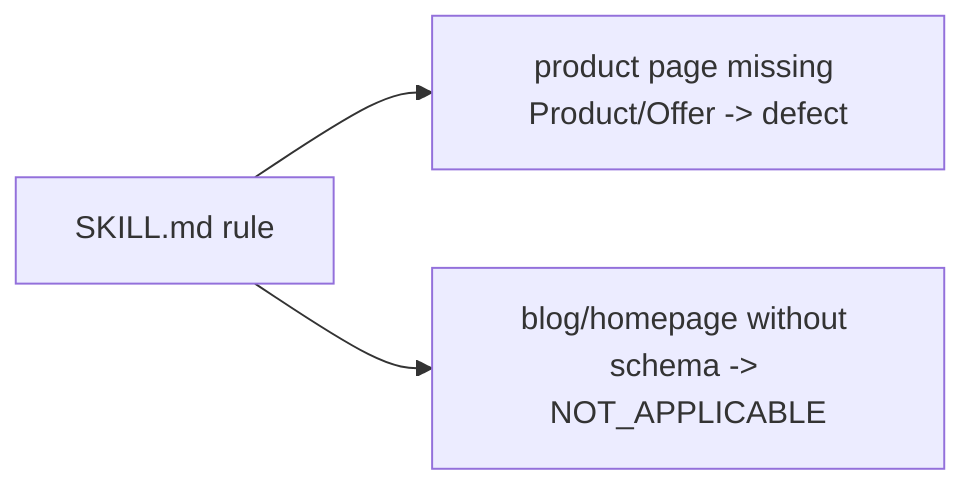

# Skill: `structured-data-audit` (sub-skill)

**Business:** answers "can an AI machine-extract facts — cost, availability, identity?" Broken JSON-LD on a product page is a revenue defect; absent schema on a blog is explicitly *not* a defect (Adobe rule, stated in the manifest).
**Tech:** `SKILL.md` documents SD-001…SD-006 (detection, parse validity, type detection, entity completeness, visible consistency, duplicate conflicts) with severity and false-positive notes; code entrypoint `src/analysis/structured_data_audit.py`.

### `SKILL.md`
**Business:** states the anti-false-positive rule in writing: missing schema on non-product pages is scored NOT_APPLICABLE, never a defect.
**Tech:** check table with severity ranges and scoring notes; entrypoint pointer.

**Parent:** [skills README](../README.md).