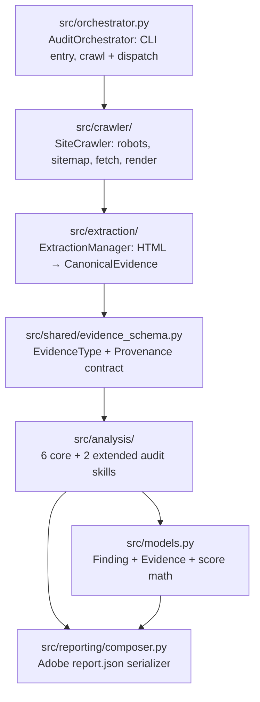
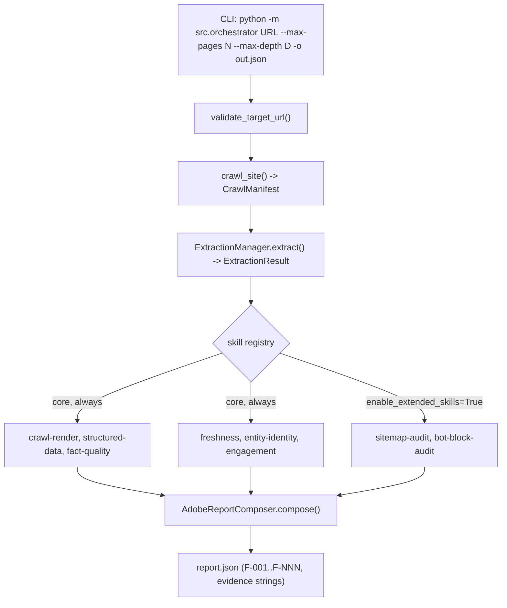
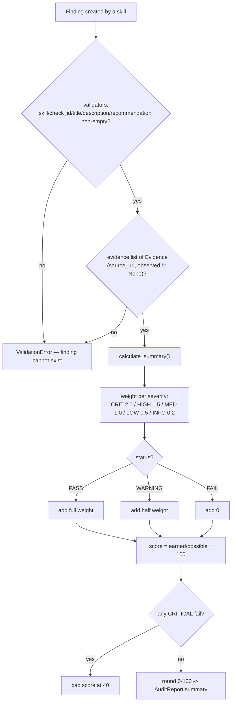

# `src/` — Core Package

**Business logic:** this package *is* the product. A brand team points it at one URL and receives an evidence-backed report of every defect that would make their site hard for AI assistants (ChatGPT, Perplexity, Gemini) to crawl, read, extract, trust, or convert visitors on. Every finding must quote real page data — a report sentence a human cannot re-verify on the live page is treated as a bug.

**Tech logic:** strict one-directional pipeline. The orchestrator crawls, the extraction layer converts raw HTTP/DOM data into canonical evidence objects, six analysis skills evaluate evidence into findings, and the composer serializes findings into the Adobe Hackathon JSON schema. No skill talks to the network about another skill's data — evidence flows one way.

## Files in this directory

| File | Role | Own diagram |
|---|---|---|
| `orchestrator.py` | Master entrypoint: validates URL, crawls, runs skill registry, saves report | [below](#orchestratorpy) |
| `models.py` | `Evidence`, `Finding`, `AuditSummary`, `AuditReport` + deterministic score | [below](#modelspy) |
| `__init__.py` | Package marker (exposes `src` as an importable package for `python -m src.orchestrator`) | — |

### `orchestrator.py`

**Business:** the single command a judge or brand manager runs. Must produce a truthful `report.json` for any URL with bounded cost (`--max-pages`, `--max-depth`).
**Tech:** `validate_target_url()` → `SiteCrawler.crawl_site()` → `ExtractionManager.extract()` → iterate `CORE_SKILL_REGISTRY` (6 skills, always on) + optional `EXTENDED_SKILL_REGISTRY` (sitemap-audit, bot-block-audit) → `AdobeReportComposer` → JSON file. Supports `html_override` / `custom_fetcher` so tests can run with zero network.

### `models.py`

**Business:** the shared language of the audit. A finding is only publishable if it has non-empty evidence, a severity, and an actionable recommendation — the validators refuse anything less, which is what keeps marketing fluff out of `findings[]`.
**Tech:** Pydantic models with `field_validator` guards; `calculate_summary()` computes a 0–100 readiness score by severity weights (CRITICAL 2.0 … INFO 0.2), counting PASS as full weight and WARNING as half; any CRITICAL fail caps the score at 40.

**Parent:** see [repository map in the root README](../README.md).