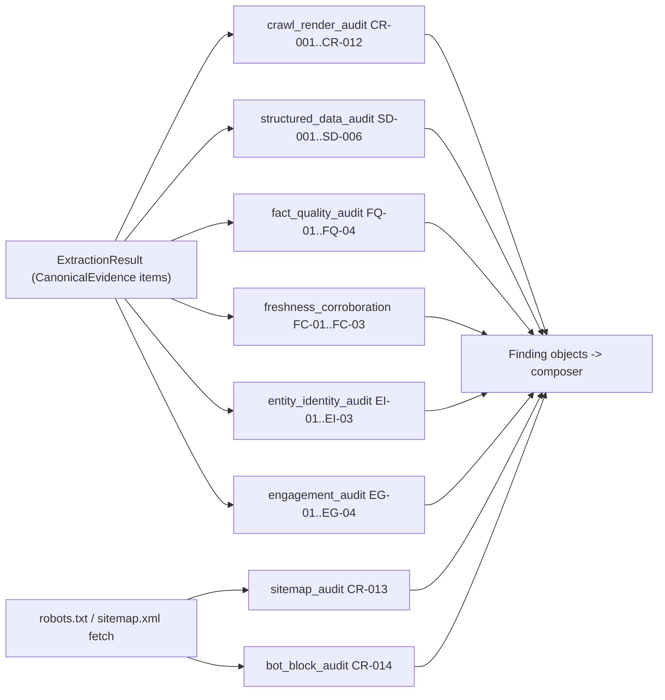
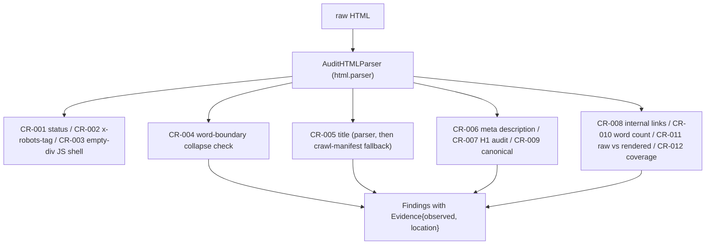
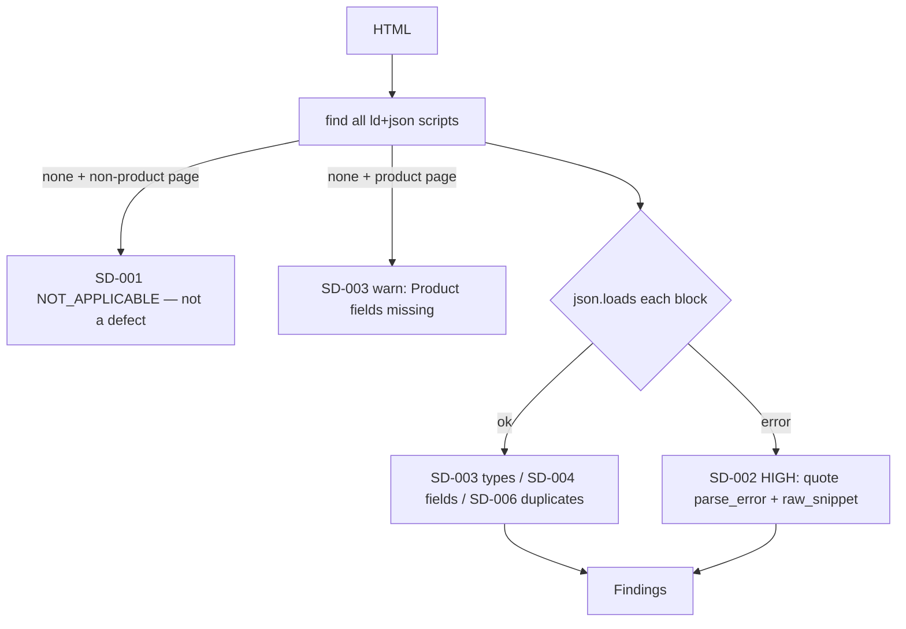
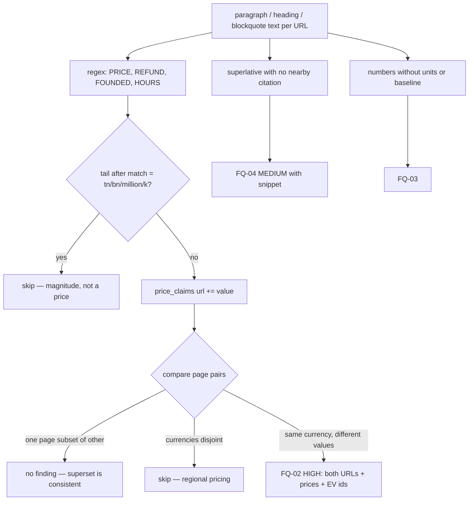
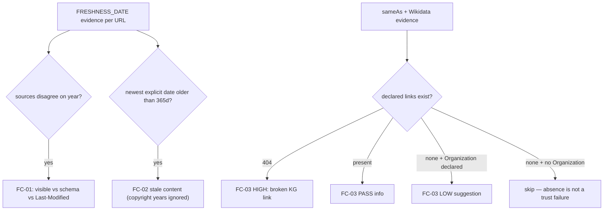
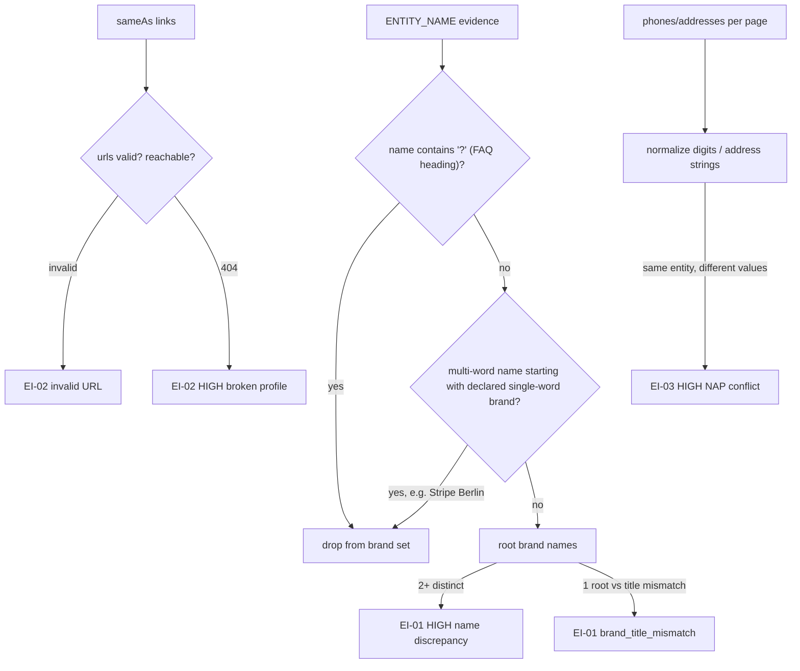
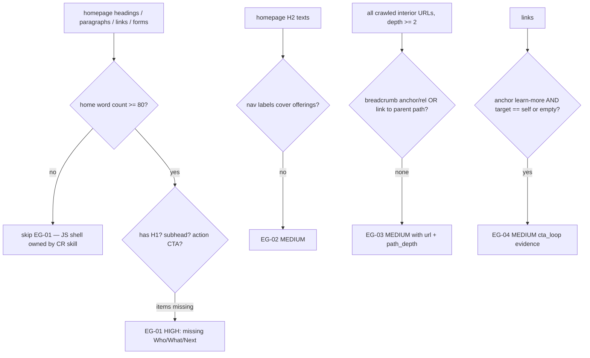
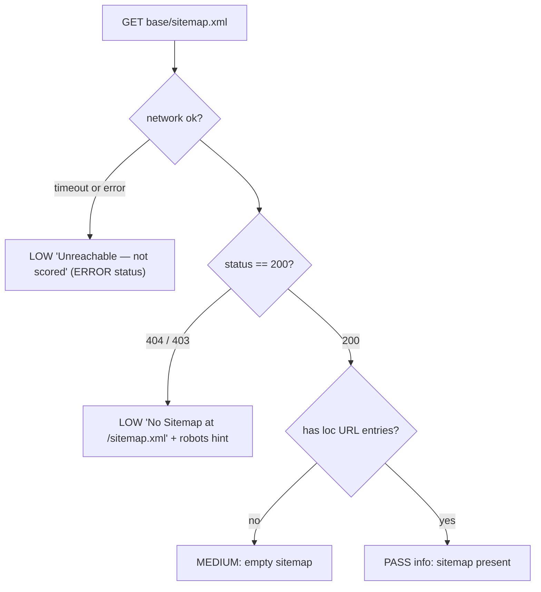
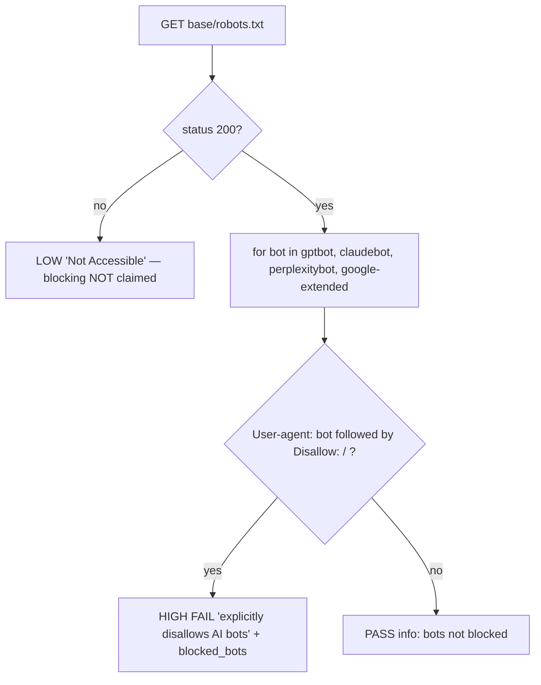
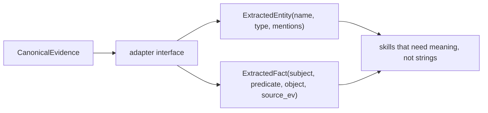

# `src/analysis/` — Audit Skills

**Business logic:** each file answers one brand-manager question: *Can AI bots reach my site? Read it? Extract structured facts? Is content trustworthy? Is brand identity unambiguous? Does the page convert?* A skill may only publish a finding backed by quoted page evidence; severity inflation is treated as a bug equal to a missed defect (Round 3 QA removed false "AI Bot Blocking" and "missing sameAs" findings).

**Tech logic:** every skill exposes `run_<skill>(evidence: ExtractionResult, website: WebsiteEvidence) -> List[Finding]`. Skills never fetch pages (except the two extended reach skills, which fetch one small root file) — they consume canonical evidence from `src/extraction/`. `PASS`/`INFO` results are emitted too, so reports show what was checked and found healthy.

### `crawl_render_audit.py` (CR-001 … CR-012)
**Business:** proves AI crawlers can physically get the content: right status code, real `<title>`/meta, meaningful headings, text that doesn't collapse into `pricingPricingAtlas`, canonical declared, internal links discoverable.
**Tech:** an in-file HTMLParser subclass walks the DOM once; CR-004 compares raw vs whitespace-normalized text lengths to catch word-boundary collapse; CR-005 falls back to the crawl-manifest title when the strict `<head><title>` parse misses (fix for the false "missing title" on wikipedia.org).

### `structured_data_audit.py` (SD-001 … SD-006)
**Business:** structured data is what lets an AI answer "what does this cost?" — broken JSON-LD on a product page is a revenue defect, while *absent* schema on a blog/homepage is not a defect (Adobe rule; enforced).
**Tech:** extracts `script[type="application/ld+json"]`, parses each with `json.loads` (SD-002 captures the exact parse error + raw snippet), detects `@type`s (SD-003), validates core identity fields on Organization/Product entities (SD-004), compares schema names to visible title/H1 (SD-005), flags conflicting duplicate declarations (SD-006).

### `fact_quality_audit.py` (FQ-01 … FQ-04)
**Business:** AI assistants quote your numbers back. If `/pricing` says $10 and `/docs` says $25, the model contradicts itself or refuses to answer — a content defect, not an SEO nit.
**Tech:** regex extraction of prices / refund windows / founding years / opening hours per URL; FQ-02 reports a contradiction only when value sets genuinely differ (subset relations tolerated). Two Round-3 fixes: (1) magnitude guard — `$1.9tn`, `$40bn` are monetary magnitudes, not offer prices; (2) cross-currency guard — a ₹ set vs a $ set is regional pricing, not a contradiction.

### `freshness_corroboration.py` (FC-01 … FC-03)
**Business:** recency is a ranking and citation signal; conflicting dates erode trust; content older than 12 months decays in generative answers; `sameAs`/Wikidata let a model verify *who* you are. Footer `© 2024` is explicitly NOT staleness evidence.
**Tech:** collects `FRESHNESS_DATE` evidence (Last-Modified, JSON-LD dates, `<time datetime>`, visible dates) per URL; FC-01 flags year-level disagreement between source types; FC-02 flags staleness only from explicit timestamps; FC-03 verifies sameAs/Wikidata reachability and only raises a LOW suggestion when an Organization entity is actually declared — never on placeholder domains.

### `entity_identity_audit.py` (EI-01 … EI-03)
**Business:** if schema says one brand name, the `<title>` another, and the footer phone differs per page, an AI cannot form one confident entity — answers fragment.
**Tech:** collects `ENTITY_NAME/PHONE/ADDRESS` + titles + H1s; EI-01 conflicts only between *root brand* names (Round-3 fix: FAQ-question strings like "Do you have setup fees?" and branch names like "Stripe Berlin" collapse away first); EI-02 validates sameAs URLs (format → HTTP) and stays silent when no Organization exists; EI-03 compares normalized phone/address sets across pages.

### `engagement_audit.py` (EG-01 … EG-04)
**Business:** a human visitor — and the AI mirroring their judgment — must know in one screen who you are, what you offer, and what to do next. A "Learn more" link pointing at itself is a conversion dead end.
**Tech:** EG-01 fires only at ≥80 words of extractable homepage text (a JS shell belongs to the crawl skill — no double counting); EG-02 checks homepage H2 "offerings" are reachable from nav labels; EG-03 walks every crawled interior URL of depth ≥2 (post-fix: including pages with zero links) and treats a link to the parent path as breadcrumb context; EG-04 flags generic anchors looping to the same page or `#`.

### `sitemap_audit.py` (CR-013, extended skill)
**Business:** a sitemap is bulk discovery for crawlers. Missing one is a *suggestion*, not a site failure — Round-3 QA demoted the old HIGH "expected 200" verdict after example.com and stripe.com showed honest 404s.
**Tech:** fetches `/sitemap.xml` with the audit UA; non-200 → LOW `No Sitemap at /sitemap.xml (HTTP …)` pointing at robots.txt `Sitemap:` declarations; a network timeout is reported *unscored* (ERROR/LOW) — never as a site defect.

### `bot_block_audit.py` (CR-014, extended skill)
**Business:** if GPTBot / ClaudeBot / PerplexityBot are explicitly `Disallow`ed, AI answers cannot cite you at all — the highest-impact reach defect. Conversely a *missing* robots.txt means default rules apply: reporting "AI Bot Blocking" for it is factually false (Round-3 QA removed that verdict).
**Tech:** parses UA groups in order, finds `Disallow: /` under each target bot; explicit block → HIGH FAIL quoting `blocked_bots`; 404/403 → LOW "robots.txt Not Accessible (HTTP …)"; timeout → LOW "not scored".

### `understanding.py`
**Business:** bridge to a semantic layer (entities/facts above raw text) so future skills can reason about *meaning* instead of strings.
**Tech:** defines `ExtractedEntity` / `ExtractedFact` models and an adapter interface the extraction layer can grow into; deliberately dependency-free today.

**Parent:** [src README](../README.md).