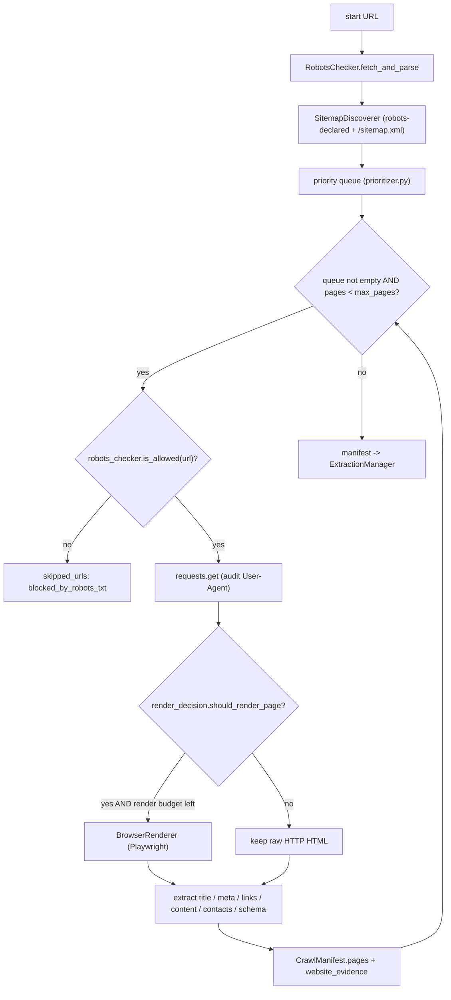
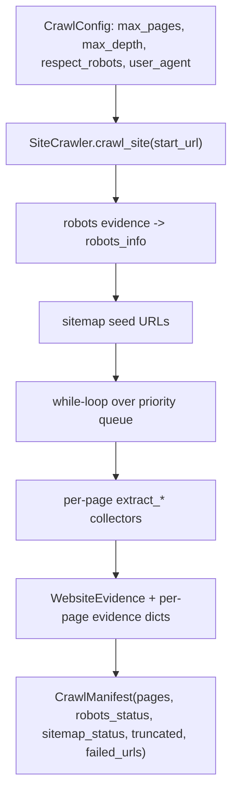
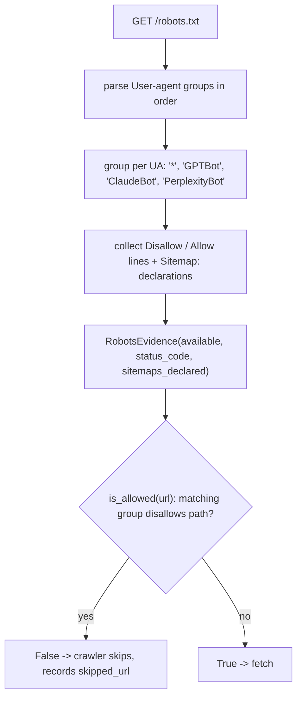
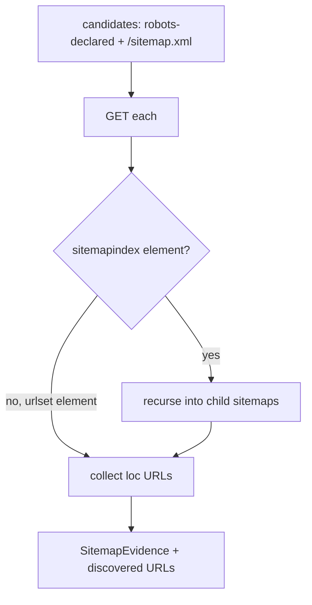
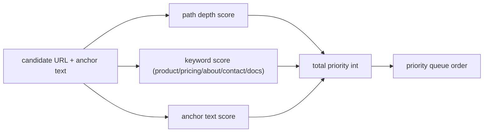
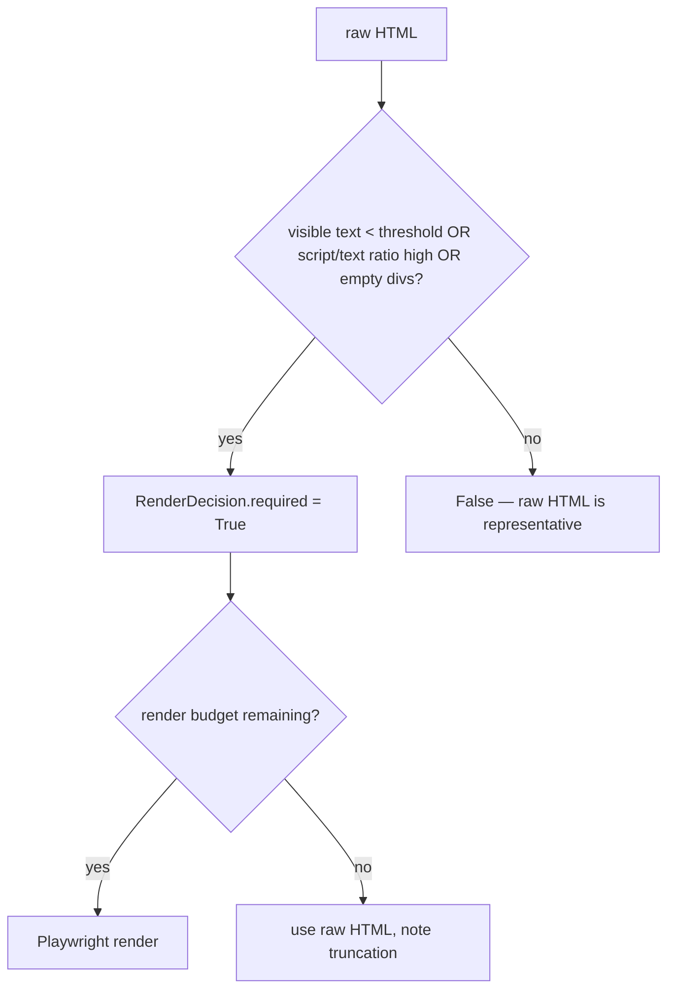
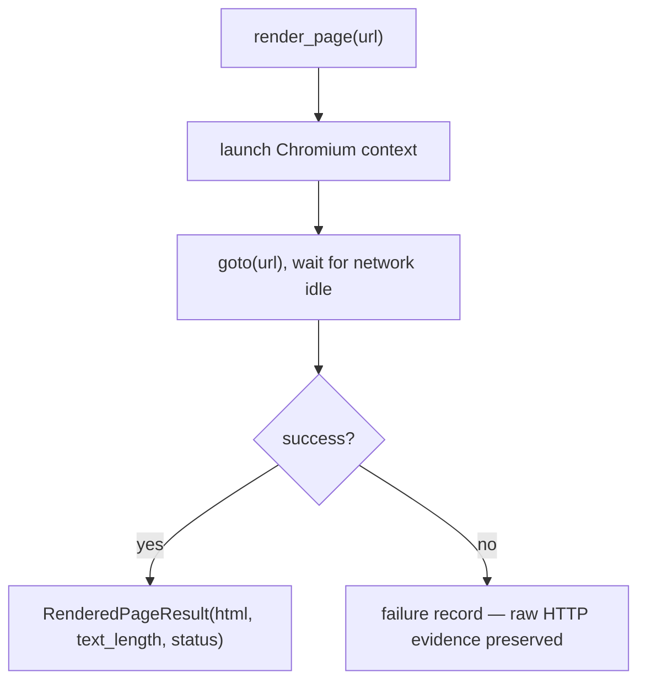
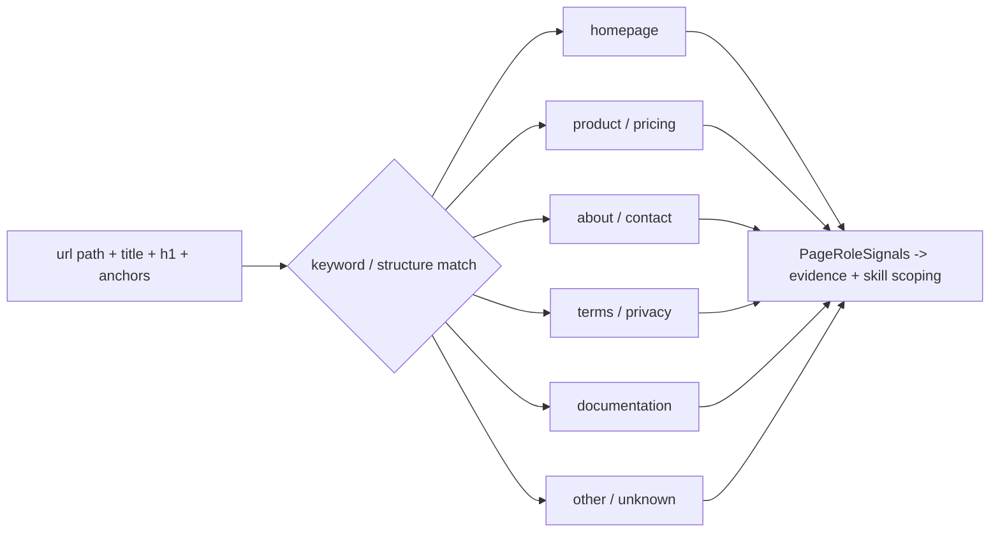
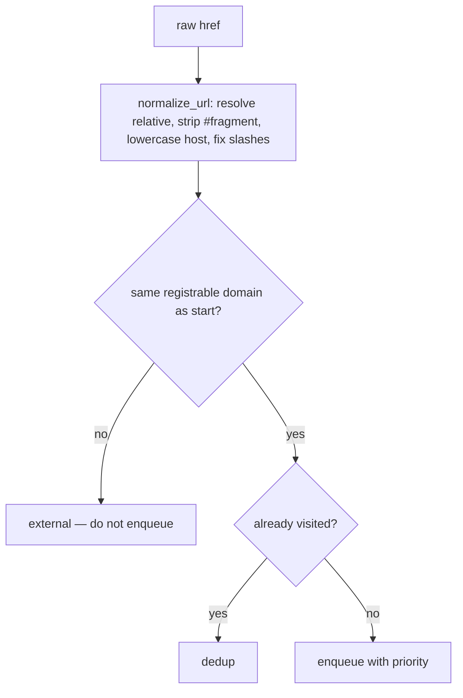

# `src/crawler/` — Discovery & Fetch Layer

**Business logic:** this layer decides *what the auditor sees*, and therefore what it is allowed to claim. It respects robots.txt like a polite AI crawler would, discovers pages through sitemaps and links, and fetches enough raw HTML to judge content honestly. Its "HTTP-first, render-only-when-needed" strategy keeps a 15-page audit cheap enough that content quality — not browser overhead — stays the point.

**Tech logic:** bounded priority-queue crawl. Robots are fetched and parsed first, sitemaps seed discovery, URLs are scored deterministically, pages are fetched with `requests` (raw HTML = what an AI crawler gets), and only pages whose raw HTML looks empty/JS-shell get considered for Playwright rendering, capped by `max_rendered_pages`. Everything a page yields (status, headers, HTML, title, word count, contacts, schema) lands in a `CrawlManifest`.

### `engine.py`
**Business:** the budgeted crawl loop — the difference between auditing 15 pages in 40 seconds and hammering a site for minutes.
**Tech:** `SiteCrawler(config: CrawlConfig)` orchestrates robots → sitemap → per-page fetch/extract/render; honors `same_domain_only`, `respect_robots`, `max_requests_per_second`; records `failed_urls`, `skipped_urls`, truncation reason; exposes `html_override`/`custom_fetcher` hooks for offline fixture tests.

### `robots.py`
**Business:** the auditor must obey — and report — the same robot rules a real GPTBot would see. A `Disallow: /` for `GPTBot` is the single most important reach finding.
**Tech:** `RobotsChecker.fetch_and_parse()` builds structured `RobotsEvidence` (available, status, UA groups, sitemap declarations); `is_allowed(url, evidence)` evaluates the longest-match UA group with `*` fallback.

### `sitemap.py`
**Business:** sitemaps reveal canonical URLs the homepage never links — critical for docs and storefronts with deep product pages.
**Tech:** `SitemapDiscoverer.discover_sitemap_urls()` checks robots-declared sitemaps plus `/sitemap.xml`, parses `<urlset>` and `<sitemapindex>` (child sitemaps recursed), returns `SitemapEvidence` + discovered URLs into the crawl frontier.

### `prioritizer.py`
**Business:** with a page budget, the auditor must spend it where the brand value is: homepage, product/pricing/about — not calendar archives.
**Tech:** `calculate_url_priority(url, anchor_text)` — deterministic scoring from path depth, path keywords (`product`, `pricing`, `about`, `contact`), and anchor text; no ML, no randomness, so audits are reproducible.

### `render_decision.py`
**Business:** JS-heavy homepages look empty to crawlers; but rendering every page is expensive. The decision engine limits browser work to pages that need it.
**Tech:** `should_render_page(html, url)` — heuristic thresholds (raw text length, script-to-text ratio, empty-container signals) → `RenderDecision.required`; the engine additionally caps rendered pages (`max_rendered_pages`) and never re-renders `html_override` fixtures.

### `browser.py`
**Business:** the fallback "what a human sees" extractor for JS shells — used sparingly.
**Tech:** `BrowserRenderer.render_page(url)` wraps isolated Playwright Chromium; returns `RenderedPageResult` (rendered HTML, text length, status) or a failure record that never destroys the raw HTTP evidence already collected.

### `role_classifier.py`
**Business:** a defect on a *product* page (missing price schema) is not the same as one on a *legal* page (no CTA). Page roles let skills apply the right rule to the right page.
**Tech:** `classify_page_role_signals()` — deterministic classification from URL path, title, headings, and anchor text into roles: `homepage`, `about`, `contact`, `product`, `pricing`, `terms`, `documentation`, `other`; returns structured `PageRoleSignals` (default `unknown` when nothing matches).

### `url_utils.py`
**Business:** the auditor must never crawl the same page twice or leak off-domain — duplicate findings and out-of-scope fetches both undermine trust in the report.
**Tech:** `normalize_url()` (resolve relative, strip fragments, lowercase host, standardize slashes), same-domain verification, base-domain extraction, dedup keys used by the engine's visited set.

**Parent:** [src README](../README.md).
