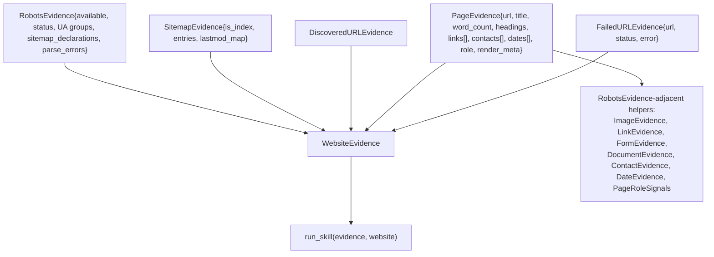
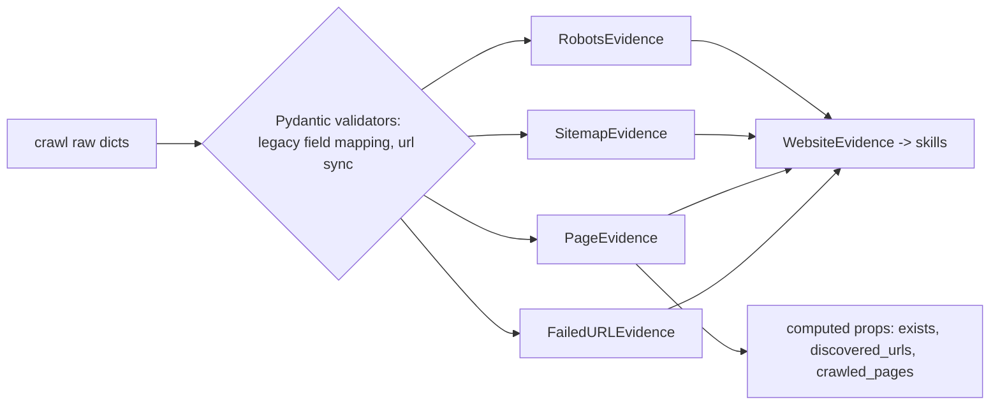

# `src/evidence/` — Shared Evidence Domain Models

**Business logic:** while `src/shared/evidence_schema.py` defines the *extraction* vocabulary, this folder defines the *crawl-domain* models the skills reason about: what a robots.txt says, what a sitemap contains, what a page holds (title, headings, links, contacts, dates, role) and what a whole website's evidence store looks like. These models are the "site as observed" picture a brand team can be shown.

**Tech logic:** Pydantic models with legacy-field mapping validators (so older manifest JSON still loads) and computed properties (`exists`, `discovered_urls`, `allow_rules`…). The top-level `WebsiteEvidence` aggregates every `PageEvidence` — the object handed to `run_<skill>(website=…)`.

### `models.py`
**Business:** one honest picture of the site per run. Reach facts (robots/sitemap), page facts (content, structure, contacts, dates), and crawl facts (failures) are separate models so skills can scope rules by page role and the report can state its own coverage limits.
**Tech:** `Provenance`, `UserAgentRuleGroup` (with `user_agent`/`allow_rules`/`disallow_rules` properties), `RobotsEvidence` (legacy-field mapper, `exists`, `crawl_delay`), `SitemapEvidence` (`is_index`, `discovered_urls`, `lastmod_map`), `PageEvidence`/`WebsiteEvidence` with `crawled_pages` property.

**Parent:** [src README](../README.md).