# `src/extraction/` — Canonical Evidence Layer

**Business logic:** this folder converts raw crawl artifacts into *facts a human can re-find in 30 seconds*. It contains **no opinions** — no findings, scores, or severity. That separation is the product's honesty guarantee: when a report says "parse_error: Expecting ',' delimiter … raw_snippet: `{ "name": "Pro"`", that sentence was produced here, as data, before any skill judged it. Round-3 QA findings ("evidence is only `observed: {same_as_count: 0}`") are enforced at this layer: evidence must carry a URL, a count, or a quoted snippet.

**Tech logic:** `ExtractionManager.extract(crawl_manifest)` fans a `CrawlManifest` out to specialized extractors. Each extractor emits `CanonicalEvidence` records (Pydantic) with a central `EvidenceIdGenerator` ID (`EV-00001`…), an `EvidenceType` from `src/shared/evidence_schema.py`, and a `Provenance` pointer (source, URL, location, selector). Errors are recorded as `ExtractionError` records, never exceptions — one broken page cannot break the audit.

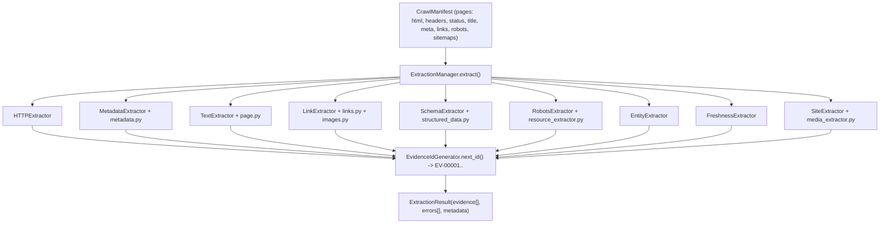

### `extraction_manager.py`
**Business:** the single coordinator that turns "a folder of fetched pages" into "an ordered evidence store" — the input contract all six audit skills share.
**Tech:** iterates manifest pages + robots/sitemap artifacts, invokes each extractor, aggregates results into one `ExtractionResult` with sequential evidence IDs and non-fatal error records.

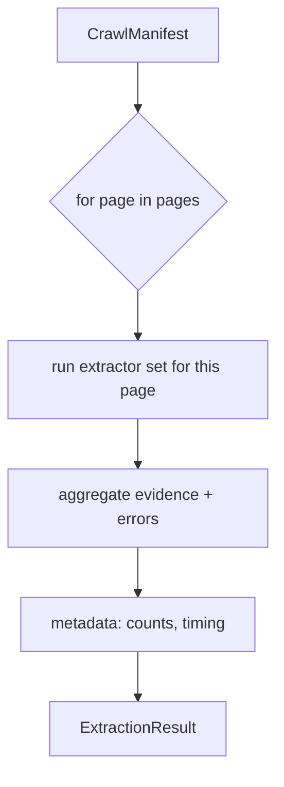

### `id_generator.py`
**Business:** every evidence item must be citable — "both prices in evidence ([EV-00024], [EV-00035])" only works if IDs exist and are stable.
**Tech:** `EvidenceIdGenerator(prefix="EV-", digits=5, start=1)` — deterministic, in-run sequential `next_id()`; one generator instance is shared by all extractors so IDs never collide.

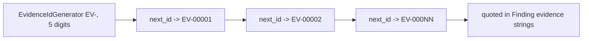

### `http_extractor.py`
**Business:** proves the page was actually reachable and describes *how* it responded — the "status a human can re-find" part of evidence.
**Tech:** `HTTPExtractor.extract_http_evidence()` — status code/reason, headers of interest (x-robots-tag, content-type), redirect chains, response timing → `HTTP_STATUS` / `HTTP_HEADER` / `HTTP_REDIRECT` evidence.

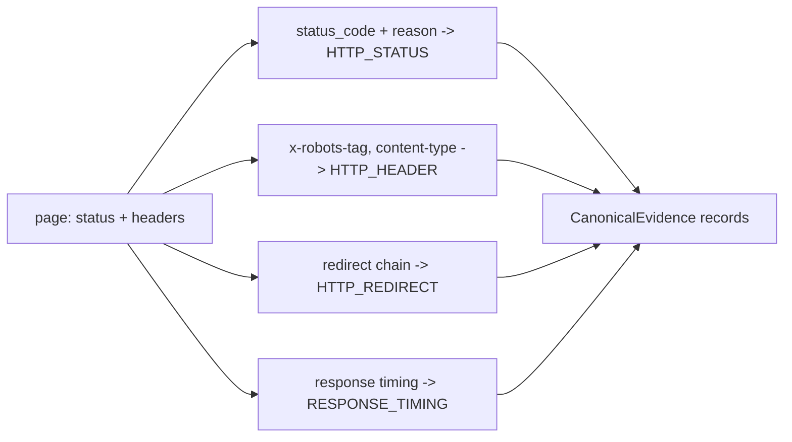

### `metadata_extractor.py` + `metadata.py`
**Business:** title, meta description, canonical, OpenGraph — the elements AI systems quote verbatim when summarizing a brand.
**Tech:** `MetadataExtractor.extract_metadata_evidence(url, html…)` parses `<head>` for `<title>`, `meta[name=description]`, `link[rel=canonical]`, language/charset/viewport, plus OG/Twitter tags (via `metadata.py` helpers); emits `PAGE_METADATA`, `CANONICAL_URL`, `OPENGRAPH_META`, `TWITTER_META`, `VIEWPORT_META` evidence.

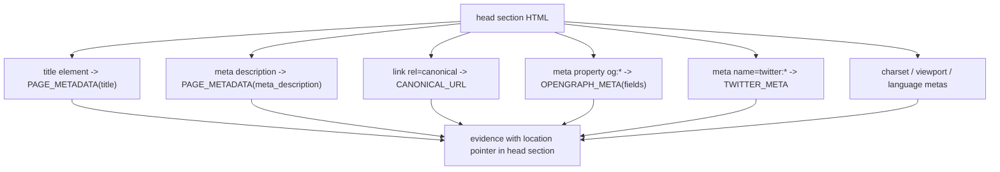

### `link_extractor.py` + `links.py` + `images.py`
**Business:** internal links are the roads a crawler (human or AI) can drive; images and downloads are extractable brand assets. Counts here feed the crawl budget and the "Discoverable Internal Links" finding.
**Tech:** `LinkExtractor.extract_link_evidence()` (over `links.py`) normalizes anchors into `LINK_ITEM`/`INTERNAL_LINK`/`EXTERNAL_LINK`/`DOCUMENT_RESOURCE` evidence with `anchor_text`, `target_url`, `is_internal`, `rel`; `images.py` classifies ``/og:image into `IMAGE_ITEM` with declared vs resolved URLs and flags 1×1 pixels as tracking.

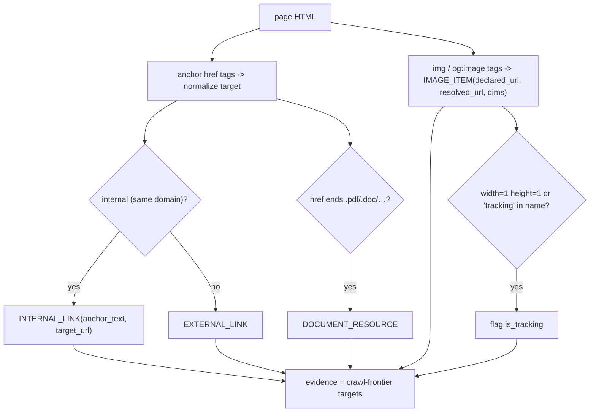

### `schema_extractor.py` + `structured_data.py`
**Business:** the structured-data layer is where "what does this cost / who are you" becomes machine-readable. This extractor captures JSON-LD **raw payloads** and parse errors so SD-002 can quote the defect exactly.
**Tech:** `SchemaExtractor.extract_schema_evidence()` (over `structured_data.py`) finds `script[type="application/ld+json"]`, attempts `json.loads` per block, records success (`JSONLD_PARSED` with `@type`s) or failure (`JSONLD_PARSE_ERROR` with the exact error string + raw snippet), plus Microdata `itemtype` elements.

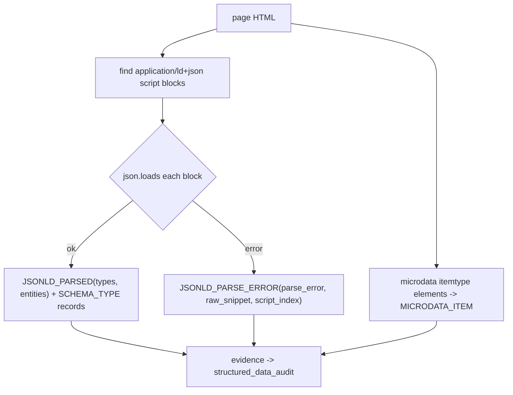

### `text_extractor.py` + `page.py`
**Business:** the "read" question: is there real extractable text, in the right structure (H1/H2 hierarchy), without words fusing together — and does raw HTML agree with any rendered DOM?
**Tech:** `TextExtractor.extract_text_evidence()` (over `page.py` DOM walking) produces headings with levels, paragraphs, list/table/blockquote/FAQ blocks, a `VISIBLE_TEXT_SUMMARY` with word counts per section, and `TEXT_EXTRACTABILITY_SIGNAL` recording raw vs normalized lengths and word-boundary collapse detection.

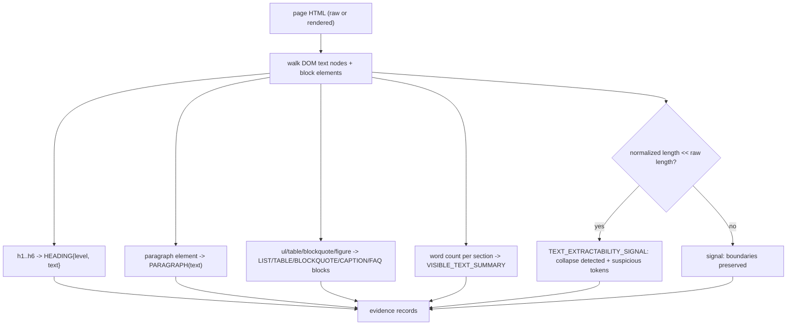

### `robots_extractor.py` + `resource_extractor.py`
**Business:** reach rules (robots directives) and machine manifests (sitemaps) are fetched facts — recorded here so reach findings quote real lines rather than categories.
**Tech:** `RobotsExtractor` normalizes robots evidence into `ROBOTS_RULE` / `ROBOTS_SITEMAP_DECLARATION` / `ROBOTS_CRAWL_DELAY` records; `ResourceExtractor.extract_sitemap_evidence()` emits `SITEMAP_ENTRY` records (and probes optional machine manifests when present).

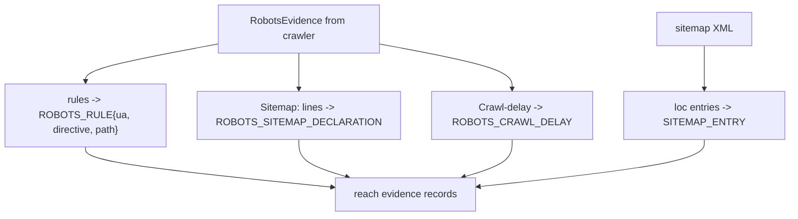

### `entity_extractor.py`
**Business:** brand identity facts — names, addresses, phones, emails, logos, sameAs/Wikidata links — are what let an AI verify *who* the brand is. Pulled from JSON-LD, microdata, and visible contact text.
**Tech:** emits `ENTITY_NAME` / `ENTITY_ADDRESS` / `ENTITY_PHONE` / `ENTITY_EMAIL` / `ENTITY_LOGO` / `SAME_AS_LINK` / `WIKIDATA_ID` / `ENTITY_IDENTIFIER` evidence with per-item location pointers (schema path or DOM context).

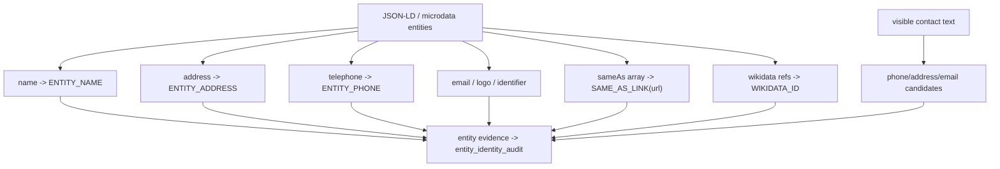

### `freshness_extractor.py`
**Business:** recency claims must be captured from every source a date can hide in — headers, schema, `<time>` tags, visible text — so date conflicts and staleness are judged from facts, and footer `© 2024` is never mistaken for content age.
**Tech:** emits `FRESHNESS_DATE` records with the source type (http_last_modified, jsonld_date, time_tag, visible_date), the ISO value, and the raw string; copyright-year hits carry a type flag that staleness checks ignore.

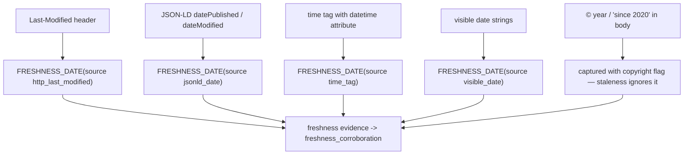

### `site_extractor.py` + `media_extractor.py`
**Business:** site-level facts (how many pages, how deep, what was skipped/truncated) tell the reader how much of the site the audit actually saw — a trust boundary on every conclusion. Forms are the conversion surfaces EG-01 looks for.
**Tech:** `SiteExtractor.extract_site_evidence()` emits `CRAWL_COVERAGE` / `CRAWL_RESOURCE_SUMMARY` / `FAILED_URL_RECORD` / `SKIPPED_URL_RECORD` / `CRAWL_ERROR`; `MediaExtractor.extract_media_evidence()` emits `IMAGE_ITEM` and `FORM_ITEM` (action, method, input fields).

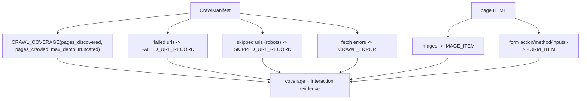

**Parent:** [src README](../README.md).
