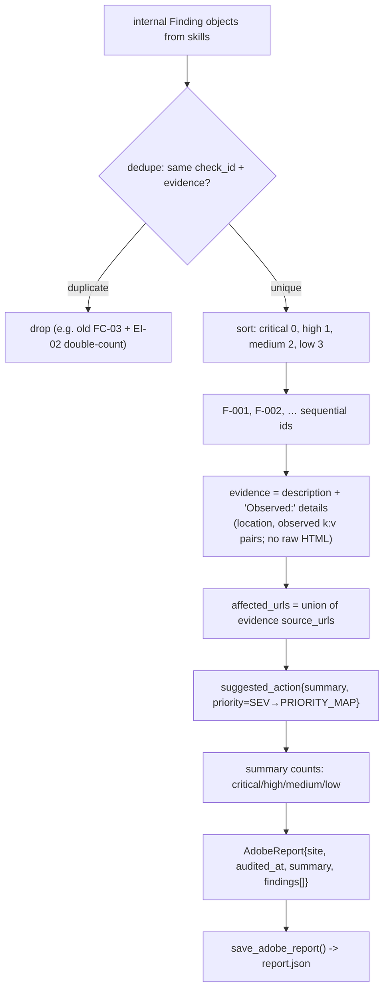
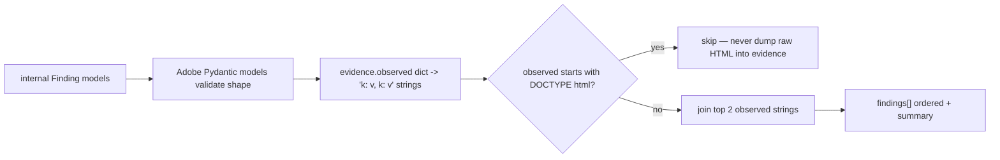

# `src/reporting/` — Adobe Report Composer

**Business logic:** this folder is the last step before a judge or brand manager reads the output, so it is where content quality becomes visible. It enforces the Adobe Hackathon schema exactly: sequential `F-001` IDs, lowercase severity, a structured `suggested_action{summary, priority}`, and — critically — **traceable evidence strings**: the composer always appends `Observed: …` details (URLs, counts, quotes) from the underlying evidence, because a finding whose evidence is only "the site is bad" fails content QA.

**Tech logic:** `AdobeReportComposer.compose(target_url, findings)` → dedupe/filter PASS noise → sort by severity weight (critical 0 … low 3) → format each into `AdobeFinding` (evidence string built from `description` + up to 2 observed-detail strings, skipping raw HTML dumps) → collect severity counts into `AdobeSummary` → top-level `AdobeReport{site, audited_at, summary, findings}`. `save_adobe_report()` serializes to `report.json`.

### `composer.py`
**Business:** the schema gate — nothing reaches the brand team unless it is ordered, deduplicated, and backed by quoted observations.
**Tech:** Pydantic models `SuggestedAction`, `AdobeFinding`, `AdobeSummary`, `AdobeReport` mirror the required schema; `PRIORITY_MAP` (critical/high→high, medium→medium, low→low) maps severity to action priority; `compose_adobe_report()` is the functional helper.

**Parent:** [src README](../README.md).