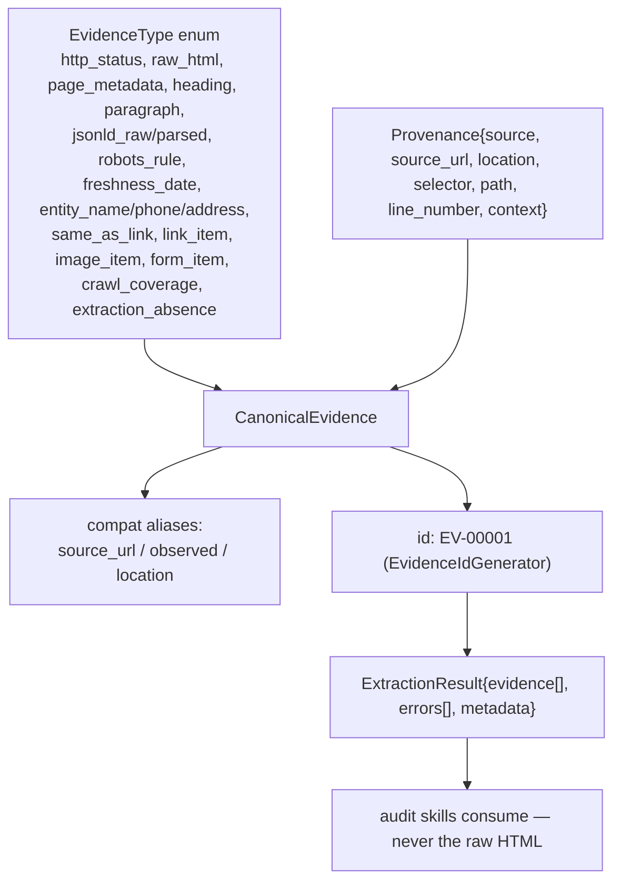
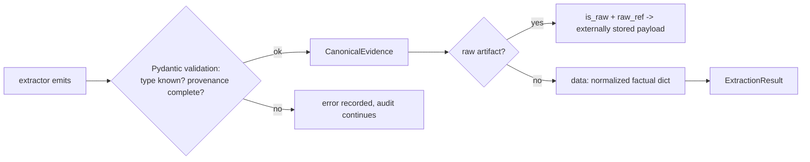

# `src/shared/` — Canonical Evidence Schema

**Business logic:** the honesty contract. Every sentence in `findings[].evidence` is only as trustworthy as the structure defined here: an evidence item must say *what type of fact it is*, *where it came from* (URL + location pointer), and *what exactly was observed*. The schema deliberately contains no findings and no scores — the split between "data" (here) and "judgment" (`src/analysis/`) is what lets a human re-verify any claim.

**Tech logic:** `EvidenceType` enum classifies every fact the system can capture (HTTP, raw artifacts, metadata, text blocks, schema, robots, freshness, entity, links, media, coverage, absence). `Provenance` is the traceability pointer (source, url, location, selector, path, line, context) with a validator that keeps `url` and `source_url` in sync. `CanonicalEvidence` is the Pydantic record all extractors emit; `ExtractionResult` is the container the skills consume. Property aliases (`source_url`, `observed`, `location`) keep audit findings compatible.

### `evidence_schema.py`
**Business:** the single vocabulary of the audit. Skills and extractors share it, so a finding's evidence is always structurally re-verifiable, and an evaluator can diff one run against another.
**Tech:** `CanonicalEvidence` (id, type, source, url, timestamp, data, provenance, is_raw/raw_ref) + `ExtractionError` (extractor, source, error, details) + `ExtractionResult`. The `Provenance` model validator normalizes `url` ↔ `source_url` so either field can be used.

**Parent:** [src README](../README.md).