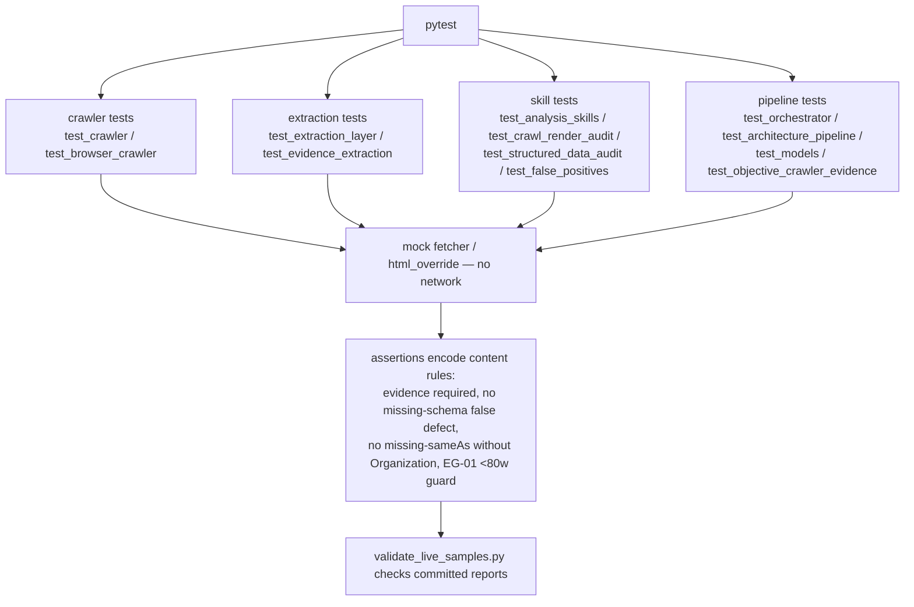

# `tests/` — Pipeline & Content-QA Tests

**Business logic:** tests exist to prevent content lies, not just crashes: the manifest documents that no finding may exist without evidence, missing schema on a non-product page must NOT be a defect, missing sameAs without a declared Organization must be silent, and EG-01 must not flag <80-word JS shells. Offline fixtures (mock fetchers / `html_override`) keep every test network-free and deterministic.

**Tech logic:** pytest suites in layers — crawler unit tests (`test_crawler.py`, `test_browser_crawler.py`), extraction layer (`test_extraction_layer.py`, `test_evidence_extraction.py`), skills (`test_analysis_skills.py`, `test_crawl_render_audit.py`, `test_structured_data_audit.py`, `test_false_positives.py`), pipeline (`test_orchestrator.py`, `test_architecture_pipeline.py`, `test_models.py`, `test_objective_crawler_evidence.py`), and live-sample validation (`live-samples/*.json`, `validate_live_samples.py`, `evaluation.md`).

### Key files
| File | Encodes |
|---|---|
| `test_analysis_skills.py` | skill-level content rules (e.g. `test_structured_data_missing_schema_on_non_product_is_not_defect`, `test_engagement_eg01_js_shell_low_word_count_not_flagged`, `test_freshness_fc03_missing_sameas_low_only_with_org_entity`) |
| `test_false_positives.py` | regression guards for known bad patterns |
| `test_orchestrator.py` | all-6-skills-executed + registry extension + URL validation |
| `live-samples/*.json` + `validate_live_samples.py` | committed real-site reports as regression anchors |
| `evaluation.md` | the Round-3 content QA method (verdicts, evidence/action 0-3) |

**Parent:** [repository root README](../README.md).